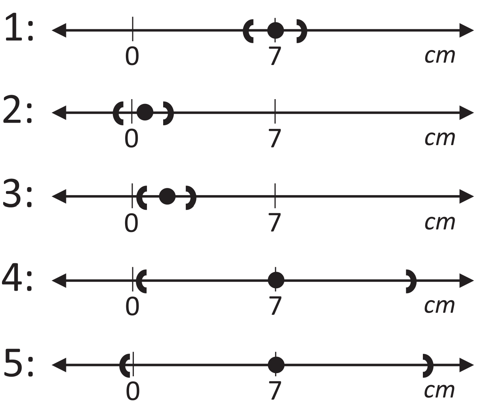
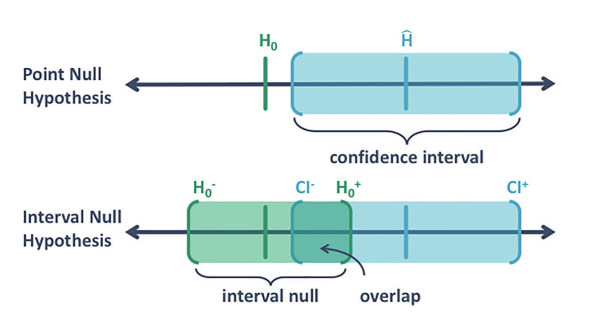

```{r include = FALSE}
library(tidyverse, quietly = TRUE)
library(plotly, quietly = TRUE)
library(knitr, quietly = TRUE)

opts_chunk$set(echo = FALSE, message = FALSE, warning = FALSE)
```
# Foreword

I am trying to present what issues are present in how p-values are currently used and which novel methods exist to potentially alleviate these issues.

I am not trying to advocate for Bayesian, Frequentist, or other methods. 

I am simply looking into what may or may not be feasible ways to help researchers have more rigorous, reproducible and transparent results.

# NHST and the $p$-value

Let's start simple and look at the general process used commonly:

* We set up our hypotheses:

  $H_0: \mu_1=\mu_2$
  $H_1: \mu_1\ne \mu_2$

* Collect our data: $\bar x_1 - \bar x_2$

* We put the data on a relative scale via a "test statistic", e.g., $t_{obs}$

* And compute the "$p$-value"

  $$P(|t_{obs}| \ge T)$$

"the probability of observing a test statistics at least as extreme as what was observed if $H_0$ is true *and* underlying model assumptions hold"


  
## You've got the $p$-value, what next?

Very often, introductory statistics courses teach:

* "Reject $H_0$ when $p < \alpha$".

* What alpha do we use? 

* $p<0.05 \to$ "reject H_0" or discovery of an "effect"

# What might be wrong with $p < 0.05$ <br> (or any sharp cutoff)

## Reproducibility

  - Setting a clear threshold encourages reporting of results that only match that criterion.
  - "Insignificance" itself can be significant. (Survivorship Bias)
  - If only $p < \alpha$ "discoveries" are reported, a higher proportion of false positives will be reported, i.e., irreproducible results.
  
## False Positives:

  - The theoretical idea of Type I error is sound under the situation of $H_0$ being true.
  - But many tests are done, some with (approximately) true $H_0$ and others with true $H_1$
  - If $P(H_0) = 0.5$ it would be expected that around at least 28% of tests result in False positives. (That's a lowerbound!) (Selke, Bayarri, & Berger 2001)

Cabras & Castellanos (2017) for bound generalization
 
## False Positive Lower Bound Chart

```{r}
alpha <- seq(0.001, 0.05, 0.001)

BFB <- function(x) {-exp(1)*x*log(x)}

astar <- function(x) {1 - 1/(1 + BFB(x))}

FPR <- astar(alpha)

p <- data.frame(alpha, FPR) %>%
  ggplot(aes(x = alpha, y = FPR)) +
  geom_smooth(se = FALSE) +
  xlab("alpha")

  ggplotly(p)

```

Keep in mind this is projected under the assumption that neither hypothesis is favored prior to the study.

# 2016 ASA Statment

*The American Statistician* published a statement from the ASA board of directors on $p$-values.

  * Intended clear and concise statement to researchers on misuse of $p$-value.
  * Explains what a $p$-value is in plain text.

## Provides principles on using $p$-values:

  * Guidelines for how to properly interpret: model incompatability and strength of evidence.
  * Common misinterpretations.
  * Transparency and avoiding $p$-hacking.
  * Statistical significance versus effect size.

## Proposes alternative methods:

  * Relying on interval estimation instead.
  * Bayesian methods.
  * Ratio types of evidence: Likelihood and Bayes Factor.
  * Decision theory.
  * False Discovery Rates.
  
No specifics were given, just "Do something else".

# 2019 TAS Supplement Issue

In 2019, *The American Statistician* published a supplementary issue.

There were 43 (!) articles on the topic, and an editorial paper titled 'Moving to a World Beyond "$p < 0.05$"'.

The articles fell into three general categories:

* Suggestions for authors and reviewers of journal articles.
* Suggestions for educators.
* Suggestions for p-value alternatives.

## 'Moving to a World Beyond "$p < 0.05$"':

* It's not enough to just say "$p < 0.05$" $\to$ bad practice.
* Don't use the phrase "statistically signicant"; maybe even don't use "significant" at all.
* Four princicples for researchers and statisticians alike, **ATOM**:
  - **A**ccept uncertainy.
  - Be **t**houghtful, ($p$-value alternatives summarised here.)
    - **o**pen,
    - **m**odest.
  
  
# $p < 0.05$ alternatives

There were four major categories of ways to "move beyond $p < 0.05$"

* Modified approach for interpreting results with $p$-values.
* Additional summary statistics to provide alongside $p$-values.
* Functions of p-values to provide different baselline interpretations.
* Complete replacements.

The order of these are potentially how we actually progress chronologically.
  
# Modified Approaches to Using $p$-values

The simplest method(s) involve a few of simple things.

1. Report your exact $p$-value to at least 3, ideally 4, significant digits.


2. Do not declare you have a "novel" discovery unless $p \le 0.005$, i.e., $\alpha = 0.005$.

| $p>0.05$  | $0.005 < p \le 0.05$| $p\le 0.005$ |
|-------------| ------------------|---------|
| "No reasonably <br> detectable effect"  | "Suggestive"        | "Discovery" |


Or by extension, treat $p$-values as a spectrum.

| $p>0.1$         | $p \approx 0.5$ | $p \approx 0.01$ | $p \approx 0.001$ | $p \le 0.0001$ |
|-----------------|-----------------|------------------|-------------------|----------------|
| Nothing notable | Suggestive      | Meaningful       | Strong            | Very Strong    |

  
## Why $p < 0.005$

This stems from the paper "Reducing Statistical Significance".

**Arguments for this change:**

* Increases replicability, by getting less false positives.
* Represents "substantial" to "strong" evidence in frequentist and Bayesisan terms, i.e., Bayes odds in favor of $H_1$ between 14 and 26
* Simple way to achieve the above points.


## Why not $p < 0.005$

**Arguments against from "Justify Your Alpha":**

* Does not increase replicability; just encourages more p-hacking due to more stringent barrier to publication.
* Weak justification.
* Harms scientific practice:
  - Fewer replication studies (gotta get that power)
  - Risk of reduced generlizability of studies due to increased convenience sampling (again, power)
  - Does not do anything about drawing focus away from $p$-values, may make it even worse.
  
* $\alpha$ should be determined by careful examination of the study beforehand. Different situtations mean different appropriate $\alpha$ if the NHST procedure is going to be used.

  
  
# $p$-value supplement: Bayes Factor Bound


## Bayes Factor

This method focuses on trying to incorporate the idea of the Bayes Factor along with the p-value. (Olive branch to both parties?)

$$BF = \frac{\text{average}^* \text{ likelihood of data under } H_1}{\text{likelihood of data under } H_0}$$

* BF is the strength of evidence in favor of $H_1$.
* Depending on preference/context, BF may instead be defined as the inverse.
* Several suggestions of cutoffs have been defined for strength of evidence a given BF value provides. (Citations?)

## Bayes Factor Bound: BFB

Berger et al. 2001

$$BF \le BFB = \frac{1}{-e p \log(p)}$$

* This provides a simple calculation for an approximate **upper bound** for BF. (Or lower bound using alternative BF)

* In other words, this an approximate upper bound of a Bayesian measure of evidence in favor alternative.

* This is the basis False Positive Rate discussed earlier.

* Berger et al. show this holds under "general" conditions.

* Recall this bound is under the assumption $H_0$ and $H_1$ are equally likely.


## Recommendations for using BFB

Benjamin & Berger (2019) suggest the following:

1. Do not use the word "significant" with $p$-values, i.e., don't use a hard cutoff. Use words like "suggestive" or "strong" evidence. ($p$-values as a specturm).

2. Report the $p$-value along with the BFB. If $p = 0.05$, then report BFB $= 2.44$ along side it, i.e., <*results statements*> ($p = 0.05$, BFB $= 2.44$).

3. Additionally report the fact that BFB is calculated based on a prior odds of $1/2$ so additionally report the upper bound for posteriod odds.

$$\text{Posterior odds bound} = BFB\cdot\frac{1}{2}$$


## Bring it all together


An example point 3, using wording from Benjamin & Berger: 

“the $p$-value of $0.05$ corresponds to the upper bound on the Bayes factor of $2.44$ which, combined with our prior odds of $1:2$, implies post-experimental odds of at most $\frac{2.44}{1}\times \frac{1}{2} = 1.22$ in favor of the alternative hypothesis.”

# Another Supplement: CIs and minimal effect size.

* p-values are simply a probability measuring a standardized extremeness.

* They do not indicate how precise our estimate is.

* Nor do they indicate how useful the conclusions we make are.

* A suggestion to alleviate this is to combine:

  - $p$-values to give us an indication of how strong our evidence is against $H_0$.
  
  - Confidence intervals let us determine it's precision.
  
  - If researchers determine a meaningful effect size prior to the study, we can gauge how meaningful the final results are.
  
## Procedure

* Establish strength of evidence for an effect. Use desired probabilistic (or other) criterion.

* Create an interval to establish precision of parameter estimate. Again, use preferred method.

* Compare interval to what is considered a meaningful effect.

* Use "thoughtful" judgement based on context and statistical information.
  - One or more criterion may override other criterion on what is considered meaningful.

* Report all information so that others can make their conclusions.

## An example (Anderson 2019)

A new corn fertilizer is being investigated, 5cm increase in plant height is considered minimal meaningful effect. 

Here are five potential outcomes of a study on the fertilizer.



# Complement/Replacement:Concentrating on Shannon information

One suggestion is concentrate on Shannon information of a $p$-value which is referred to as an $s$-value (Greenland 2019).


$$s = \log_2\left(\frac{1}{p}\right) = -\log_2(p)$$

This tells us how many bits of information we have against the null hypothesis.

## Interpreting $s$ values

* Let $k$ be the integer closest to $s$, then $p$ is roughly the same level of evidence against a coin being fair if we saw all heads in $k$ flips.

* $p = 0.05$ $\to$ $s = -\log_2(p) = 4.3$: The evidence is not much more surprising than seeing 4 heads in a row when tossing a coin.

* $p = 0.005$ gives $s = 7.6$: The observed data are a little less surpising than 8 coin flips of heads in a row.

* "Would you believe a coin is unfair if you saw $k$ heads in a row?"

# Complete $p$-value "replacement": Second Generation $p$-values 

Blume et al. (2019) suggest something they refer to as a "Second Generation $p$-Values" (SGPV).

The motivations for it are:

* Incorporate the idea of scientifically important findings via defining a meaningful effect size.

* Assess the validity of the hypothesis via a measure with same range of values as a $p$-value, $0$ to $1$, that does not confound sample size and effect size.

* Keep the simplicitly of an automatic decision rule that maintains as simple relation with Type I error specified by $\alpha$.

## Procedure for SGPV

The procedure can be simplified into a few stages.

* Specify a range of values for the effect which would be considered not meaningful. 

  Let $\theta$ be the parameter/effect of interest:

  $$H_0: \theta_L < \theta < \theta_U$$
  
  Anything in between is considered un important.
  
* Gather data and compute an interval using your preferred method be it Frequentist, Bayes, or other.

* Compute SGPV, $p_\delta$, the proportion of the intervals that overlap. (Details to follow.)


## Illustration of SGPV method

Figure from Blume et al. (2019):


  
## $p_\delta$ with precise intervals

Denote the width of the computed interval and $|I|$ and the null hypothesis interval width by $|H_0|$.

$I$ is "precise", which is defined as $|I| \le 2|H_0|$.

  $$p_\delta = \frac{\text{Overlap of $I$ and $H_0$}}{|I|}$$
  
  * The proportion of $I$ in $H_0$
  * If $I$ is completely in $H_0$ we get $p_\delta = 1$
  

## $p_\delta$ with imprecise intervals

$I$ is "imprecise" which is defined to be $|I| > 2|H_0|$

  $$p_\delta = \frac{1}{2} \cdot \frac{\text{Overlap of $I$ and $H_0$}}{|H_0|}$$
  
  * The proportion of $H_0$ in $I$
  * If $H_0$ is completely in $I$ we get $p_\delta = 0.5$.
  
Precise versus imprecise definitions prevent small values of $p_\delta$ when the intervals are excessively large.


## Interpreting $p_\delta$

Given the definition of $p_\delta$, potential values range from 0 to 1.

  * $p_\delta = 0$ indicates that the data are not compatible with $H_0$ according to the error criterion you used for $I$.
  
  * $p_\delta = 1$ indicates that data are compatible with $H_0$
  
  * $p_\delta = 0.5$ indicates the data are completely inconclusive with regards to $H_0$ compatibility.
  

# Supplement to NHST: Analysis of Credibility (AnCred)

Mathews (2019) proposes what they refer to as Analysis of Credibility (AnCred).

  * NHST is unlikely to be changed fundamentally in the short-term.
  * AnCred is a proposal of combining NHST with principles of Bayesian inference
  
  $$\text{Prior insight } + \text{ Data likelihood } \to \text{ Posterior insight}$$
  
  * AnCred takes the results of a typical hypothesis test and assesses it's "credibility" via Bayesian methods with automated prior distribution choice.
  - There is an AnCred procedure for "significant" results.
  - There is also a procedure for "insignificant" results.
  

## AnCred General Procedure

The general procedure is as follows:

1. Summarize study findings via 95% CI. (Different confidence levels are possible of course.) This is the data likelihood.

2. Use the CI to compute a *Critical Prior Interval* (CPI).
  
  * Based on using the ikelihood to deduce the range of prior
effect sizes which, when combined with the likelihood, lead
to a posterior range that just excludes no effect at the 95%
level.

  * For "significant" results the a Skepticism CPI is calculated.
  
  * For "nonsignificant" results an Advocacy CPI is calculated.

3. Use the CI, CPI, and prior studies to assess the credibility of results.

## AnCred for "significant" results (Skepticism Limit mode)

In AnCred there are two situations when results are significant

1. There are prior studies to compare to: The findings are deemed credible if prior studies indicate an effect size beyond the Skepticism CPI.
  
2. An unprecedented result was found: the findings are deemed credible if the CI point estimate lies beyond the bounds of the Skepticism CPI.

Otherwise results may be "significant" but not credible.

## Ancred for "nonsignificant" results (Advocacy Limit Mode)

For "nonsignificant" results, a non-zero effect size is determined to be credible if prior studies are within the Advocacy CPI.

The logistics are somewhat complex, for a deeper understanding please read the paper:

Robert A. J. Matthews (2019) Moving Towards the Post $p < 0.05$ Era via the Analysis of Credibility, The American Statistician, 73:sup1, 202-212, DOI: 10.1080/00031305.2018.1543136

# Summary of methods and some subjective comments

## Decrease alpha

- Very simple.
- Dichotomy issue remains.
- Does nothing to address interpretation problems.
- More stringent methods motivate more $p$-hacking.

## Bayes Factor Bound

- Simple calculation.
- Provides additional context.
- The assumption $P(H_0) = P(H_1)$ implies researchers have no idea which way results will go.
- Issues with arbitrary cutoffs exist for using BF.
- Additional numbers may make interpretations more difficult.
  
## Holistic method: Combine $p$, CI, and effect size

- Uses already common tools.
- Accounts for statistical versus scientific significance.
- Dealing with several different numbers makes conclusions difficult and leaves open room for controversy (is this good or bad?).
- May not generalize well with higher dimensional problems depending on researchers' needs.
  
  
## Shannon Information: $s$-values

- Simple calculation.
- Provides an alternative interpretation to the $p$-value.
- Not much else.
- May cause some head scratching.


## Second Generation $p$-Values

- A simple summary of statistical and scientific signicance
- Fairly interpretable (in my opinion).
- Not restricted to any particular methodology, e.g., Frequentist, Bayes, etc.
- Still promotes dichotomy.

## Analysis of Credibility

- Bridge between Bayes and other methods
- Provides a framework for non-dichotomy
- Takes what is done in existing practice and tries to aid it.
- The framework and terminology can be confusing.
- Current derived work applies to limited number of situations.

# That's a wrap

## References

[Bibliography](https://www.evernote.com/shard/s663/client/snv?noteGuid=25443010-fb6e-49e8-8a00-f9b9e1cc7c46&noteKey=cf16bcdb4e34d6ed55602a2b583a45fa&sn=https%3A%2F%2Fwww.evernote.com%2Fshard%2Fs663%2Fsh%2F25443010-fb6e-49e8-8a00-f9b9e1cc7c46%2Fcf16bcdb4e34d6ed55602a2b583a45fa&title=Bibliography)

## Everybody's favorite part: Questions? Comments? Other?